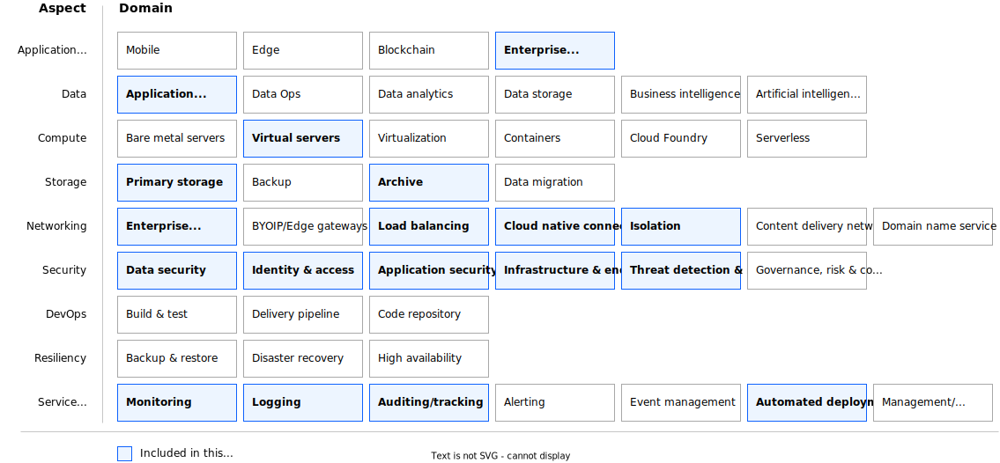

---

copyright:
  years: 2024
lastupdated: "2024-09-05"
keywords:
subcollection: deployable-reference-architectures
authors:
  - name: Stafania Saju
  - name: Ludwig Mueller
production: true
deployment-url: https://cloud.ibm.com/catalog/architecture/deploy-arch-ibm-pvs-sap-9aa6135e-75d5-467e-9f4a-ac2a21c069b8-global
docs: https://cloud.ibm.com/docs/sap-powervs
image_source: https://github.com/terraform-ibm-modules/terraform-ibm-powervs-sap/blob/main/reference-architectures/sap-ready-to-go-stack/deploy-arch-ibm-pvs-sap-ready-to-go-stack.svg
use-case: ITServiceManagement
industry: Technology
compliance: SAPCertified
content-type: reference-architecture
version: v3.1.0
related_links:
  - title: 'SAP in IBM Cloud documentation'
    url: 'https://cloud.ibm.com/docs/sap'
    description: 'SAP in IBM Cloud documentation.'
  - title: 'Reference architecture for "Power Virtual Server with VPC landing zone" as full stack deployment'
    url: 'https://cloud.ibm.com/docs/deployable-reference-architectures?topic=deployable-reference-architectures-deploy-arch-ibm-pvs-inf-full-stack'
    description: 'Reference architecture for "Power Virtual Server with VPC landing zone" as full stack deployment'

---

{{site.data.keyword.attribute-definition-list}}

# Power Virtual Server for SAP HANA - variation 'SAP Ready PowerVS Create a new architecture'
{: #sap-ready-to-go-stack}
{: toc-content-type="reference-architecture"}
{: toc-industry="Technology"}
{: toc-use-case="ITServiceManagement"}
{: toc-compliance="SAPCertified"}
{: toc-version="3.1.0"}

The SAP-ready PowerVS with VPC landing zone variation of the Power Virtual Server for SAP HANA is designed to simplify the deployment of an end-to-end SAP ERP software landscape on the IBM Power Virtual Server infrastructure into IBM Cloud. This variation builds a VPC landing zone and deploys Power Virtual Servers that are tuned to be ready for SAP HANA and SAP NetWeaver. It deploys one HANA-ready instance and one or more NetWeaver-ready instances. Optionally, it also deploys an additional Power Virtual Server for shared SAP files.

This variation leverages the two [deployable architectures](https://cloud.ibm.com/docs/secure-enterprise?topic=secure-enterprise-understand-module-da#what-is-da) [Power Virtual Server with VPC landing zone](https://cloud.ibm.com/catalog/architecture/deploy-arch-ibm-pvs-inf-2dd486c7-b317-4aaa-907b-42671485ad96-global?kind=terraform&format=terraform&version=7cee3b92-c691-4394-aed5-b090cbffb403-global) and [Power Virtual Server for SAP HANA - SAP Ready PowerVS variant](https://cloud.ibm.com/catalog/architecture/deploy-arch-ibm-pvs-sap-9aa6135e-75d5-467e-9f4a-ac2a21c069b8-global?catalog_query=aHR0cHM6Ly9jbG91ZC5pYm0uY29tL2NhdGFsb2c%2Fc2VhcmNoPXBvd2VyI3NlYXJjaF9yZXN1bHRz&kind=terraform&format=terraform&version=6ce2294f-fcb3-4d52-80f6-414917f4876d-global).

This variation does not install any SAP software or solutions. For that, use SAP S4/HANA or BW/4HANA variation.

Services such as DNS, NTP, and NFS running in VPC and provided by Power Virtual Server with VPC landing zone are leveraged.

The transit gateway provides the network bridge between the IBM Power infrastructure and the IBM Cloud® VPC and public internet.

The resulting SAP landscape leverages services such as Activity Tracker, Cloud Object Storage, Key Management from the VPC landing zone, and network connectivity configuration provided by Power Virtual Server with VPC landing zone.

## Architecture diagram
{: #sap-ready-to-go-stack-architecture-diagram}

{: caption="Figure 1. VPC + PowerVS instances prepared to run SAP in PowerVS workspace" caption-side="bottom"}{: external download="deploy-arch-ibm-pvs-sap-ready-to-go-stack.svg"}

## Design requirements
{: #sap-ready-to-go-stack-design-requirements}

{: caption="Figure 2. Scope of the solution requirements" caption-side="bottom"}

IBM Cloud Power Virtual Servers (PowerVS) is a public cloud offering that allows an enterprise to establish its own private IBM Power computing environment on shared public cloud infrastructure. PowerVS is logically isolated from all other public cloud tenants and infrastructure components, creating a private, secure place on the public cloud. Due to its scalability and resilience, PowerVS is the premium platform for SAP workloads in the cloud world. The reference architecture for 'Power Virtual Server for SAP HANA' - variation 'SAP ready PowerVS with VPC landing zone' is designed to provide PowerVS Linux instances prepared and configured for SAP HANA and SAP NetWeaver workloads according to the best practices and requirements using IBM Cloud® deployable architectures framework.

## Components
{: #sap-ready-to-go-stack-components}

### VPC architecture decisions
{: #standard-vpc-components-arch}

| Requirement | Component | Choice | Alternative choice |
|-------------|-----------|--------------------|--------------------|
|* Ensure public internet connectivity  \n * Isolate most virtual instances to not be reachable directly from the public internet|Edge VPC service with network services security group.|Create a separate security group service where public internet connectivity is allowed to be configured| |
|* Provide infrastructure administration access  \n * Limit the number of infrastructure administration entry points to ensure security audit|Edge VPC service with management security group.|Create a separate security group where SSH connectivity from outside is allowed| |
|* Provide infrastructure for service management components like backup, monitoring, IT service management, shared storage  \n * Ensure you can reach all IBM Cloud and on-premises services|Client to site VPN, NFS as a service(NFSaaS) and security groups |Create a client to site VPN and VPE full strict security groups rules without direct public internet connectivity and without direct SSH access| |
|* Allow customer to choose operating system from two most widely used commercial Linux operating system offerings  \n * Support new OS releases|Linux operating system|Red Hat Enterprise Linux (RHEL)| |
|* Create a virtual server instance as the only management access point to the landscape|Bastion host VPC instance|Create a Linux VPC instance that acts as a bastion host. Configure ACL and security group rules to allow SSH connectivity (port 22). Add a public IP address to the VPC instance. Allow connectivity from a restricted and limited number of public IP addresses. Allow connectivity from IP addresses of the Schematics engine nodes| |
|* Create a virtual server instance that can act as an internet proxy server and to host basic management services like DNS, NTP, NFS|Network services VPC instance|Create a Linux VPC instance that can host management components. Preconfigure ACL and security group rules to allow traffic over private networks only.|Configure application load balancer to act as proxy server manually, Modify number of virtual server instances and allowed ports in preset or perform the modifications manually|
|* Ensure financial services compliancy for VPC services  \n * Perform network setup of all created services  \n * Perform network isolation of all created services  \n * Ensure all created services are interconnected |Secure landing zone components|Create a minimum set of required components for a secure landing zone|Create a modified set of required components for a secure landing zone in preset|
{: caption="Table 1. VPC architecture decisions" caption-side="bottom"}

### PowerVS workspace architecture decisions
{: #standard-pvs-components-workspace}

| Requirement | Component | Choice | Alternative choice |
|-------------|-----------|--------------------|--------------------|
|* Connect PowerVS workspace with VPC services|Transit gateway| Set up a local transit gateway| |
|* Configure the network for management of all instances  \n * Throughput and latency are not relevant|Management network|Configure private network with default configurations| |
|* Configure separate network for backup purposes with higher data throughput|Backup network|Configure separate private network with default configurations. Network characteristics might be adapted by the users manually (for example to improve throughput)| |
|* Preload OS images relevant for customer workload|Preloaded OS images|Preload Stock catalog OS images.|Modify the input parameter that specifies the list of preloaded OS images.|
|* Preload a public SSH key that is injected into every OS deployment|Preloaded SSH public key|Preload customer specified SSH public key| |
{: caption="Table 2. PowerVS workspace architecture decisions" caption-side="bottom"}

### PowerVS management services architecture decisions
{: #standard-pvs-components-mgmt}

| Requirement | Component | Choice | Alternative choice |
|-------------|-----------|--------------------|--------------------|
|* Ensure public internet connectivity from all the instances to be deployed in PowerVS workspace|SQUID proxy|Set up SQUID proxy software on Linux virtual server instance that is running in edge VPC|                    |
|* Provide shared NFS storage that might be directly attached to all the instances to be deployed in PowerVS workspace| File storage shares in VPC|Use the files storage share service running in VPC. Disk size is specified by the user.||
|* Provide time synchronization to all instances to be deployed in PowerVS workspace|NTP forwarder|Synchronize time by using public NTP servers. Set up time synchronization on Linux virtual server instance that is running in workload VPC.|By using time synchronization servers directly reachable from PowerVS workspace, NTP forwarder is not required.|
|* Provide a DNS forwarder to a DNS server not directly reachable from PowerVS workspace (for example, running on-premises or in other isolated environment)|DNS forwarder|Configure DNS forwarder on Linux virtual server instance that is running in edge VPC| By using default IBM Cloud DNS service, DNS forwarder is not needed. Direct domain name resolution is possible.|
{: caption="Table 3. PowerVS management services architecture decisions" caption-side="bottom"}

### Network security architecture decisions
{: #standard-net-sec}

| Requirement | Component | Choice | Alternative choice |
|-------------|-----------|--------------------|--------------------|
|* Preload VPN configuration to simplify VPN setup|VPNs|VPN configuration is the responsibility of the customer. Automation creates a client to site VPN server||
|* Enable floating IP on bastion host to execute deployment|Floating IPs on bastion host in management VPC|Use floating IP on bastion host from IBM Schematics to complete deployment||
|* Isolate management VSI and allow only a limited number of network connections  \n * All other connections from or to management VPC are forbidden|Security group rules for management VSI|Open following ports by default: 22 (for limited number of IPs).  \n All ports to PowerVS workspace are open.  \n All ports to other VPCs are open.|More ports might be opened in preset or added manually after deployment|
|* Isolate network services VSI, VPEs and NFaaS |Security group rules in edge VPC|Separate security groups are created for each component and only certain IPs or Ports are allowed. |More ports might be opened in preset or added manually after deployment|
{: caption="Table 4. Network security architecture decisions" caption-side="bottom"}

### Key and password management architecture decisions
{: #standard-key-pw}

| Requirement | Component | Choice | Alternative choice |
|-------------|-----------|--------------------|--------------------|
|* Use public/private SSH key to access virtual server instances by using SSH  \n * Use SSH proxy to log in to all virtual server instances by using the bastion host  \n * Do not store private ssh key on any virtual instances, also not on the bastion host  \n * Do not allow any other SSH login methods except the one with specified private/public SSH key pair|Public SSH key - provided by customer. Private SSH key - provided by customer.|Ask customer to specify the keys. Accept the input as secure parameter or as reference to the key stored in IBM Cloud Secure Storage Manager. Do not print SSH keys in any log files. Do not persist private SSH key.|                    |
|* Use public/private SSH key to access virtual server instances by using SSH  \n * Use SSH proxy to log in to all virtual server instances by using the private IPS of instances using a VPN client  \n * Do not store private ssh key on any virtual instances  \n * Do not allow any other SSH login methods except the one with specified private/public SSH key pair|Public SSH key - provided by customer. Private SSH key - provided by customer.|Ask customer to specify the keys. Accept the input as secure parameter or as reference to the key stored in IBM Cloud Secure Storage Manager. Do not print SSH keys in any log files. Do not persist private SSH key.|                    |
{: caption="Table 5. Key and passwords management architecture decisions" caption-side="bottom"}

### PowerVS networks for SAP - architecture decisions
{: #sap-ready-to-go-stack-pvs-components}

The architecture decisions are comprised of those from the two components.

| Requirement | Component | Choice | Alternative choice |
|-------------|-----------|--------------------|--------------------|
|* Provide reliable network for communication between SAP HANA and SAP NetWeaver instances  \n * Ensure that SAP network meet SAP requirements related to throughput and latency|SAP network|Create a separate SAP network for each SAP system. Tune SAP network in operating system according to SAP on Power best practices.|For very large SAP systems more than one SAP network may be needed. | Additional networks might be created manually and attached to the SAP system.|
|* Provide network for SAP system backups  \n * Ensure that backup network provides enough throughput| Backup network | Attach backup network that was created with the PowerVS workspace in 'Power infrastructure for deployable architecture'|For large landscapes with several SAP systems more than one backup network may be needed. | Additional networks might be created manually and attached to the SAP system.|
| Provide network for SAP system management | Management network | Attach management network that was created with the PowerVS workspace in 'Power infrastructure for deployable architecture'| |
{: caption="Table 1. PowerVS networks for SAP - architecture decisions" caption-side="bottom"}

### PowerVS instances for SAP - architecture decisions
{: #sap-ready-to-go-stack-instance-components}

| Requirement | Component | Choice | Alternative choice |
|-------------|-----------|--------------------|--------------------|
|* Deploy PowerVS instance for SAP HANA workload  \n * Use SAP certified configurations regarding CPU and memory combinations (t-shirt sizes)  \n * Prepare operating system for SAP HANA workload | PowerVS instance | * Allow customer to specify certified SAP configuration and calculate all additional parameters automatically  \n * Attach all required storage filesystems based on PowerVS instance memory size  \n * Attach networks for management, backup and for SAP system internal communication  \n * Connect instance with infrastructure management services like DNS, NTP, NFS  \n * Perform OS configuration for SAP HANA| Allow customer to specify additional parameters, like non-standard file system sizes |
|* Deploy PowerVS instances for SAP NetWeaver workload  \n * Prepare operating system for SAP NetWeaver workload | PowerVS instance | * Allow customer to specify number of instances that must be deployed and CPU and memory for every instance  \n * Attach all required storage filesystems  \n * Attach networks for management, backup and for SAP system internal communication  \n * Connect instance with infrastructure management services like DNS, NTP, NFS  \n * Perform OS configuration for SAP NetWeaver | Allow customer to specify additional parameters, like non-standard file system sizes |
|* Deploy PowerVS instance for hosting shared SAP system files  \n * Prepare operating system | PowerVS instance | Host shared SAP system files on one of PowerVS instances for SAP NetWeaver and do not deploy a separate PowerVS instance | * Allow customer to deploy PowerVS instance with specified CPU and memory  \n * Attach specified storage filesystems  \n * Attach networks for management, backup and for SAP system internal communication  \n * Connect instance with infrastructure management services like DNS, NTP, NFS  \n * Perform OS configuration  \n * Allow customer to specify additional parameters, like non-standard file system sizes |
{: caption="Table 2. PowerVS workspace architecture decisions" caption-side="bottom"}

### Key and password management architecture decisions
{: #sap-ready-to-go-stack-full-key-pw}

| Requirement | Component | Choice | Alternative choice |
|-------------|-----------|--------------------|--------------------|
|* Use public/private SSH key to access virtual server instances by using SSH  \n * Use SSH proxy to log in to all virtual server instances by using the bastion host  \n * Do not store private SSH keys on any virtual instances or on the bastion host  \n * Do not allow any other SSH login methods except the one with specified private and public SSH key pairs|Public SSH key - provided by customer. Private SSH key - provided by customer.|Ask customer to specify the keys. Accept the input as secure parameter or as reference to the key stored in IBM Cloud Secure Storage Manager. Do not print SSH keys in any log files. Do not persist private SSH key.|                    |
{: caption="Table 3. Key and passwords management architecture decisions" caption-side="bottom"}

## Compliance
{: #sap-ready-to-go-stack-compliance}

This deployable architecture is certified for SAP deployments.

## Next steps
{: #next-steps}

Install the SAP system.
