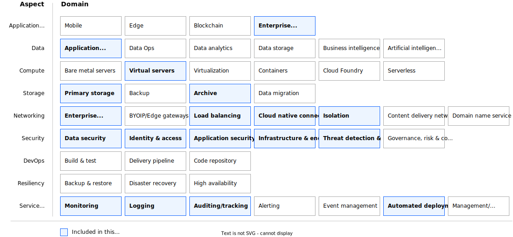

---

copyright:
  years: 2024, 2025, 2026
lastupdated: "2026-01-14"
keywords:
subcollection: deployable-reference-architectures
authors:
  - name: Arnold Beilmann
  - name: Suraj Bharadwaj
  - name: Ludwig Mueller
  - name: Trilochan Pandey
production: true
deployment-url: https://cloud.ibm.com/catalog/architecture/deploy-arch-ibm-pvs-sap-9aa6135e-75d5-467e-9f4a-ac2a21c069b8-global
docs: https://cloud.ibm.com/docs/sap-powervs
image_source: https://github.com/terraform-ibm-modules/terraform-ibm-powervs-sap/blob/main/reference-architectures/sap-s4hana-bw4hana/deploy-arch-ibm-pvs-sap-s4hana-bw4hana.svg
use-case: ITServiceManagement
industry: Technology
compliance: SAPCertified
content-type: reference-architecture
version: v6.0.1
related_links:
  - title: 'SAP in IBM Cloud documentation'
    url: 'https://cloud.ibm.com/docs/sap'
    description: 'SAP in IBM Cloud documentation.'

---

{{site.data.keyword.attribute-definition-list}}

# Power Virtual Server for SAP HANA - variation 'SAP S/4HANA or BW/4HANA'
{: #sap-s4hana-bw4hana}
{: toc-content-type="reference-architecture"}
{: toc-industry="Technology"}
{: toc-use-case="ITServiceManagement"}
{: toc-compliance="SAPCertified"}
{: toc-version="v6.0.1"}

'SAP S/4HANA or BW/4HANA' variation of 'Power Virtual Server for SAP HANA' creates a basic and expandable SAP system landscape built on the foundation of 'Power Virtual Server with VPC landing zone'. PowerVS instances for SAP HANA and SAP NetWeaver are deployed and pre-configured for SAP installation. The S/4HANA or BW/4HANA solution is installed based on the selected version.

Services such as DNS, NTP, and NFS runs in VPC.

Transit gateway connections provide the network bridge between the IBM Power infrastructure and the IBM Cloud® VPC and public internet.

The resulting SAP landscape leverages the services such as Activity Tracker, Cloud Object Storage, Key Management from the VPC landing zone and the network connectivity configuration. Additionally, it will also setup Monitoring and SCC Workload Protection if the features were enabled during the landing zone deployment.

## Architecture diagram
{: #sap-s4hana-bw4hana-architecture-diagram}

{: caption="Figure 1. Full SAP S/4HANA or BW/4HANA environment provisioned on a 'Power Virtual Server with VPC landing zone'" caption-side="bottom"}{: external download="deploy-arch-ibm-pvs-sap-s4hana-bw4hana.svg"}

## Design requirements
{: #sap-s4hana-bw4hana-design-requirements}

{: caption="Figure 2. Scope of the solution requirements" caption-side="bottom"}

IBM Cloud Power Virtual Servers (PowerVS) is a public cloud offering that allows an enterprise to establish its own private IBM Power computing environment on shared public cloud infrastructure. Due to its scalability and resilience, PowerVS is the premium platform for SAP workloads in the cloud world. The reference architecture for 'Power Virtual Server for SAP HANA' - variation 'SAP S/4HANA or BW/4HANA' is designed to provide PowerVS Linux instances prepared and configured for SAP HANA and SAP NetWeaver workloads according to the best practices and requirements using IBM Cloud® deployable architectures framework. Additionally, S/4HANA or BW/4HANA solution is installed based on the selected version.

## Components
{: ##sap-s4hana-bw4hana-components}

### VPC for SAP - architecture decisions
{: #sap-s4hana-bw4hana-vpc-components}

| Requirement | Component | Choice | Alternative choice |
|-------------|-----------|--------------------|--------------------|
|* Ensure public internet connectivity  \n * Isolate most virtual instances to not be reachable directly from the public internet|Edge VPC service with network services security group.|Create a separate security group service where public internet connectivity is allowed to be configured| |
|* Provide infrastructure administration access  \n * Limit the number of infrastructure administration entry points to ensure security audit|Edge VPC service with management security group.|Create a separate security group where SSH connectivity from outside is allowed| |
|* Provide infrastructure for service management components like backup, monitoring, IT service management, shared storage  \n * Ensure you can reach all IBM Cloud and on-premises services|Client to site VPN, NFS as a service(NFSaaS) and security groups |Create a client to site VPN and VPE full strict security groups rules without direct public internet connectivity and without direct SSH access| |
|* Allow customer to choose operating system from two most widely used commercial Linux operating system offerings  \n * Support new OS releases|Linux operating system|Red Hat Enterprise Linux (RHEL)| |
|* Create a virtual server instance as the only management access point to the landscape|Bastion host VPC instance|Create a Linux VPC instance that acts as a bastion host. Configure ACL and security group rules to allow SSH connectivity (port 22). Add a public IP address to the VPC instance. Allow connectivity from a restricted and limited number of public IP addresses. Allow connectivity from IP addresses of the Schematics engine nodes| |
|* Create a virtual server instance that can act as an internet proxy server and to host basic management services like DNS, NTP, NFS|Network services VPC instance|Create a Linux VPC instance that can host management components. Preconfigure ACL and security group rules to allow traffic over private networks only.|Configure application load balancer to act as proxy server manually, Modify number of virtual server instances and allowed ports in preset or perform the modifications manually|
|* Ensure financial services compliancy for VPC services  \n * Perform network setup of all created services  \n * Perform network isolation of all created services  \n * Ensure all created services are interconnected |Secure landing zone components|Create a minimum set of required components for a secure landing zone|Create a modified set of required components for a secure landing zone in preset|
|* Allow customer to optionally enable monitoring in the deployment|IBM Cloud® monitoring instance and Monitoring Host VPC Instance|Optionally, create or import an existing IBM Cloud® monitoring instance (customer provided details) and create and configure the Monitoring Host VPC instance to  collect information and send it to the IBM Cloud® monitoring instance.| |
|* Allow customer to optionally enable [Security and Compliance Center Workload Protection](/docs/workload-protection) in the deployment \n * Collect posture management information, enable vulnerability scanning and threat detection|IBM Cloud® Security and Compliance Center Workload Protection and SCC Workload Protection agent on all VPC instances in the deployment.|Optionally, create an IBM Cloud® Security and Compliance Center Workload Protection instance and install and setup the SCC Workload Protection agent on all VPC instances in the deployment (bastion, network services, monitoring hosts).| |
{: caption="Table 1. VPC architecture decisions" caption-side="bottom"}

### PowerVS workspace for SAP - architecture decisions
{: #sap-s4hana-bw4hana-workspace-components}

| Requirement | Component | Choice | Alternative choice |
|-------------|-----------|--------------------|--------------------|
|* Connect PowerVS workspace with VPC services|Transit gateway| Set up a local transit gateway| |
|* Configure the network for management of all instances  \n * Throughput and latency are not relevant|Management network|Configure private network with default configurations| |
|* Configure separate network for backup purposes with higher data throughput|Backup network|Configure separate private network with default configurations. Network characteristics might be adapted by the users manually (for example to improve throughput)| |
|* Allow optional import of custom OS images from Cloud Object Storage|Custom OS images|Import up to three images from COS into the PowerVS workspace.|Modify the optional input parameters that specify the list of custom OS images and the COS configuration and credentials .|
|* Preload a public SSH key that is injected into every OS deployment|Preloaded SSH public key|Preload customer specified SSH public key| |
{: caption="Table 2. PowerVS workspace architecture decisions" caption-side="bottom"}

### PowerVS networks for SAP - architecture decisions
{: ##sap-s4hana-bw4hana-pvs-components}

| Requirement | Component | Choice | Alternative choice |
|-------------|-----------|--------------------|--------------------|
|* Provide reliable network for communication between SAP HANA and SAP NetWeaver instances  \n * Ensure that SAP network meet SAP requirements related to throughput and latency|SAP network|Create a separate SAP network for each SAP system. Tune SAP network in operating system according to SAP on Power best practices.|For very large SAP systems more than one SAP network may be needed. | Additional networks might be created manually and attached to the SAP system.|
|* Provide network for SAP system backups  \n * Ensure that backup network provides enough throughput| Backup network | Attach backup network that was created with the PowerVS workspace in 'Power infrastructure for deployable architecture'|For large landscapes with several SAP systems more than one backup network may be needed. | Additional networks might be created manually and attached to the SAP system.|
| Provide network for SAP system management | Management network | Attach management network that was created with the PowerVS workspace in 'Power infrastructure for deployable architecture'| |
{: caption="Table 1. PowerVS networks for SAP - architecture decisions" caption-side="bottom"}

### PowerVS instances for SAP - architecture decisions
{: ##sap-s4hana-bw4hana-instance-components}

| Requirement | Component | Choice | Alternative choice |
|-------------|-----------|--------------------|--------------------|
|* Deploy PowerVS instance for SAP HANA workload  \n * Use SAP certified configurations regarding CPU and memory combinations (t-shirt sizes)  \n * Prepare operating system for SAP HANA workload | PowerVS instance | * Allow customer to specify certified SAP configuration and calculate all additional parameters automatically  \n * Attach all required storage filesystems based on PowerVS instance memory size  \n * Attach networks for management, backup and for SAP system internal communication  \n * Connect instance with infrastructure management services like DNS, NTP, NFS  \n * Perform OS configuration for SAP HANA| Allow customer to specify additional parameters, like non-standard file system sizes |
|* Deploy PowerVS instances for SAP NetWeaver workload  \n * Prepare operating system for SAP NetWeaver workload | PowerVS instance | * Allow customer to specify number of instances that must be deployed and CPU and memory for every instance  \n * Attach all required storage filesystems  \n * Attach networks for management, backup and for SAP system internal communication  \n * Connect instance with infrastructure management services like DNS, NTP, NFS  \n * Perform OS configuration for SAP NetWeaver | Allow customer to specify additional parameters, like non-standard file system sizes |
|* Optionally, configure monitoring to provide a dashboard with relevant information about the SAP applications and selected system statistics | All PowerVS instances, IBM Cloud® Monitoring Instance, Monitoring Host VPC Instance| Optionally, setup the monitoring host in the VPC to collect relevant information from the Database and application servers and send it to the IBM Cloud® Monitoring Instance | |
|* Optionally, enable [Security and Compliance Center Workload Protection](/docs/workload-protection) on the PowerVS instances \n * Collect posture management information, enable vulnerability scanning and threat detection|IBM Cloud® Security and Compliance Center Workload Protection, Sysdig agent on all PowerVS instances in the deployment.|Optionally, install and configure the sysdig agent on PowerVS instances in the deployment | The automation automatically picks up the configuration from the landing zone. If SCC Workload Protection is enabled in the landing zone, the Sysdig agent will be installed and configured on all PowerVS instances in this deployment. |
{: caption="Table 2. PowerVS workspace architecture decisions" caption-side="bottom"}

### Key and password management architecture decisions
{: ##sap-s4hana-bw4hana-full-key-pw}

| Requirement | Component | Choice | Alternative choice |
|-------------|-----------|--------------------|--------------------|
|* Use public/private SSH key to access virtual server instances by using SSH  \n * Use SSH proxy to log in to all virtual server instances by using the bastion host  \n * Do not store private SSH keys on any virtual instances or on the bastion host  \n * Do not allow any other SSH login methods except the one with specified private and public SSH key pairs|Public SSH key - provided by customer. Private SSH key - provided by customer.|Ask customer to specify the keys. Accept the input as secure parameter or as reference to the key stored in IBM Cloud Secure Storage Manager. Do not print SSH keys in any log files. Do not persist private SSH key.|                    |
{: caption="Table 3. Key and passwords management architecture decisions" caption-side="bottom"}

## Compliance
{: #sap-s4hana-bw4hana-compliance}

This deployable architecture is certified for SAP deployments.
